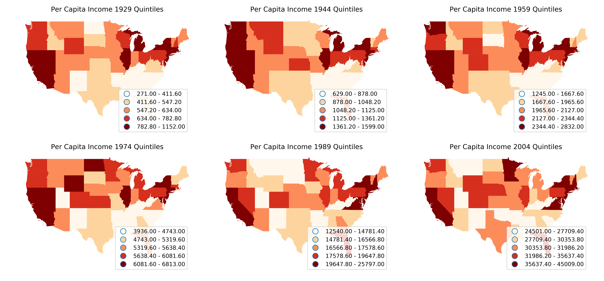
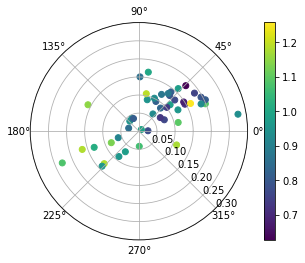
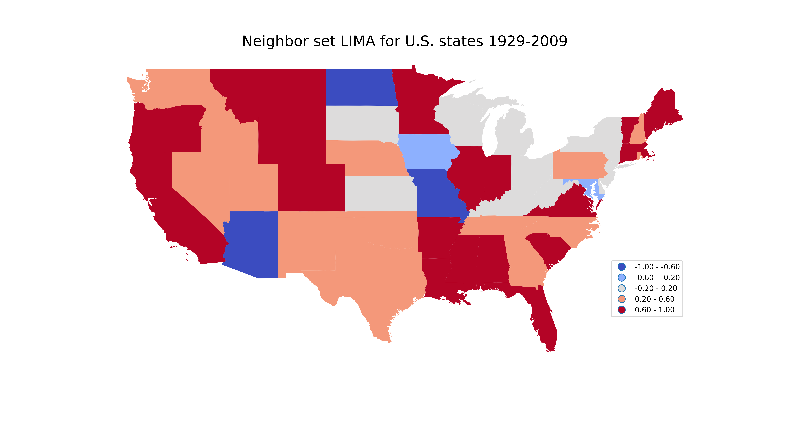

GeospatIal Distribution DYnamics (giddy) in PySAL
=================================================

[](https://travis-ci.org/pysal/giddy)

Space–time analytics that consider the role of space in the evolution of distributions over time.

*Blow are six choropleth maps of US state incomes from 1929 to 2004 at a five-year interval.*



Features
--------
- Directional LISA, inference and visualization as rose diagram

[](notebooks/directional.ipynb)

*Above shows the rose diagram (directional LISAs) for US states incomes across 1969-2009 conditional on relative incomes in 1969.*

- Spatially explicit Markov methods:
    - Spatial Markov and inference
    - LISA Markov and inference
- Spatial decomposition of exchange mobility measure (rank methods):
    - Global indicator of mobility association (GIMA) and inference
    - Inter- and intra-regional decomposition of mobility association and inference
    - Local indicator of mobility association (LIMA)
        - Neighbor set LIMA and inference
        - Neighborhood set LIMA and inference

[](notebooks/Rank%20based%20Methods.ipynb)

- Income mobility measures

Examples
--------

* [Directional LISA](notebooks/directional.ipynb)
* [Markov based methods](notebooks/Markov%20Based%20Methods.ipynb)
* [Rank based methods](notebooks/Rank%20based%20Methods.ipynb)
* [Mobility measures](notebooks/Mobility%20measures.ipynb)

Installation
------------

Install giddy by running:

```
$ pip install giddy
```

#### Requirements

- scipy
- numpy
- libpysal
- esda
- mapclassify

Contribute
----------

PySAL-giddy is under active development and contributors are welcome.

If you have any suggestion, feature request, or bug report, please open a new [issue](https://github.com/pysal/giddy/issues) on GitHub. To submit patches, please follow the PySAL development [guidelines](http://pysal.readthedocs.io/en/latest/developers/index.html) and open a [pull request](https://github.com/pysal/giddy). Once your changes get merged, you’ll automatically be added to the [Contributors List](https://github.com/pysal/giddy/graphs/contributors).

Support
-------

If you are having issues, please talk to us in the [gitter room](https://gitter.im/pysal/giddy).

License
-------

The project is licensed under the [BSD license](https://github.com/pysal/giddy/blob/master/LICENSE.txt).


